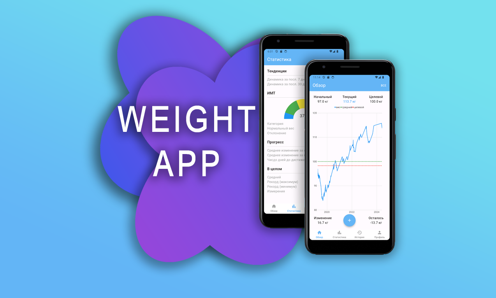

# Weight app



## How to Start

```bash
$ flutter run
```

## How open database at emulator (adb)

1- Go to your platform-tools folder in a command prompt

```bash
$ cd %USERPROFILE%\AppData\Local\Android\Sdk\platform-tools
```

2- Enter the command `adb devices` to get the list of your devices

```bash
$ C:\Users\user\AppData\Local\Android\Sdk\platform-tools>adb devices
List of devices attached
emulator-5554   device
```

3- Connect a shell to your device:

```bash
adb -s emulator-5554 shell
```

addional

To check all packages available

```bash
$ pm list packages
```

```bash
package:com.example.weight
```

4a- You can bypass this step on rooted device

```bash
run-as <your-package-name>
```

```bash
$ run-as com.example.weight
emu64xa:/data/user/0/com.example.weight $
```

4b- Navigate to the folder containing your db file:

```bash
cd databases/
```

5- run sqlite3 to connect to your db:

```bash
sqlite3 <your-db-name>.db
```

6- run sqlite3 commands that you like eg:

```bash
Select \* from table1 where ...;
```

```bash
select * from weights;
```

## Additional

List the tables in your database:

```bash
.tables
```
